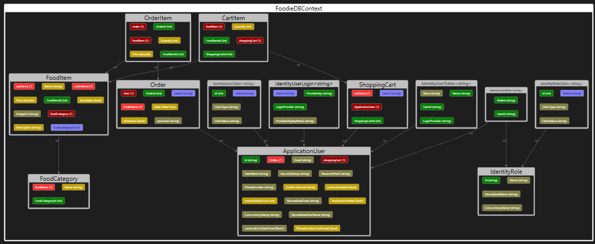
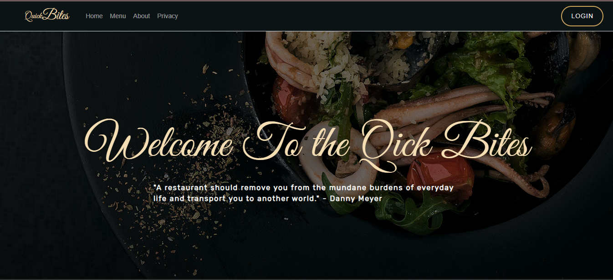
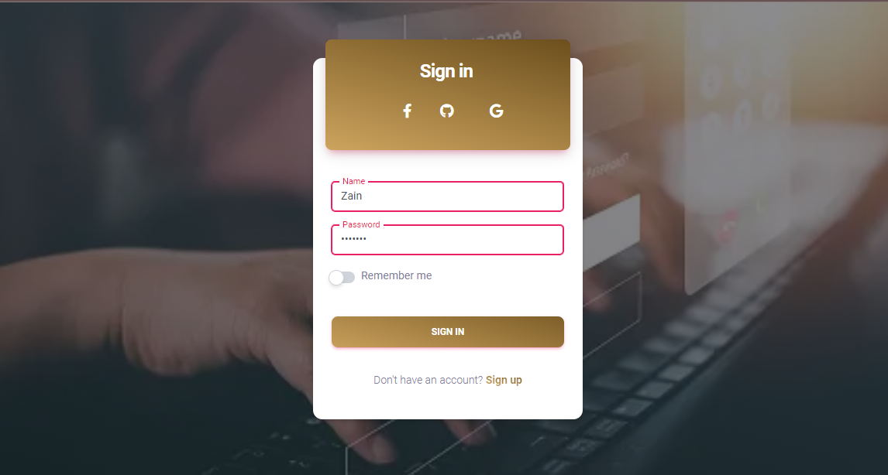
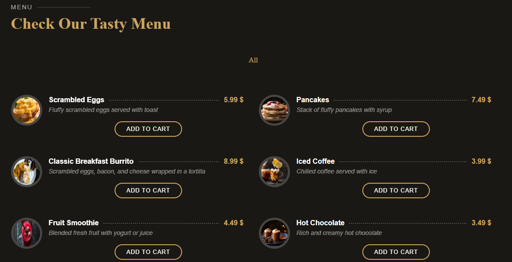
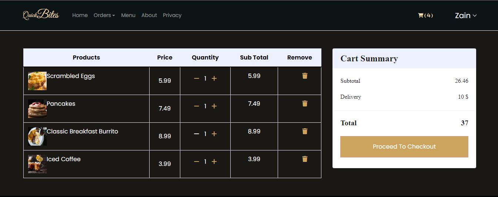
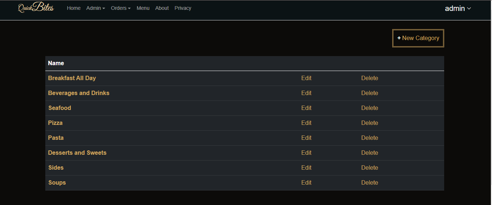
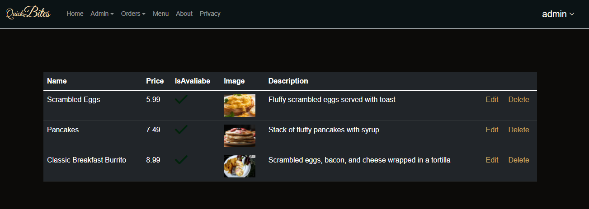
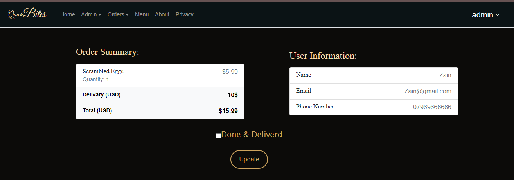

# Quick Bites E-Commerce Web Application 

## Table of Contents
- [Introduction](#introduction)
- [Deployment](#deployment)
- [Product Overview](#product-overview)
- [Database Schema](#database-schema)
- [Explanation of Database Schema](#explanation-of-database-schema)
- [Captured Claims](#captured-claims)
- [Enforced Policies](#enforced-policies)

---

## Introduction

+ Welcome to the Quick Bites E-Commerce Web Application README. This document provides an overview of our application, its deployment, the product we are selling, our database schema, an explanation of our database structure, the claims we capture, and the policies we enforce.

---

## Deployment

- **Website Link**: [Quick Bites E-Commerce Web Application](https://quickfoodiapp20231001201422.azurewebsites.net/)

---

## Product Overview

+ At Quick Bites, we offer a wide range of delicious culinary delights. Our product offerings include a diverse menu of dishes, from appetizers to main courses and desserts.

---

## Database Schema

Our database schema primarily consists of the following tables:

- **Users**: Stores information about registered users.
- **FoodCategory**: Contains data related to Our Food Categories.
- **FoodItems**: Lists all food items for each Food Category.
- **Orders** Records orders placed by users.
- **CartItems** Stores items added to the shopping cart.
- **ShoppingCarts** Manages user shopping carts.
- **OrderItems** Contains details about items within an order.

---

## Explanation of Database Schema

- **Users**: This table stores user information, including their username, email, and hashed password.
- **FoodCategory** Display The categories in the restaurant like Lunch,drinks.deserts and so on and it also Provide links to view Items of each category.
- **FoodItem** Display all products for each food category for example for the drinks it contains Coffee Tea juice etc. and it include details for each one of them Availability price and others 
- **Orders** Records order information, including order Id and the UserId who make the order , it also contains the session ID and the date of this order , the status id , the order if it is delevired or not yet, the User that place the order and also the order Items list that contains the items of the order
- **OrderItems** Contains details of items within an order, including food item, quantity, and price.
- **CartItems** Stores items added to the user's shopping cart, including food item details and quantity.
- **ShoppingCarts** Manages user shopping carts and links them to specific users.
---

## Captured Claims

We capture the following claims for various purposes:

- **User Information**: Captured during registration and login for account management and personalization.

---

## Enforced Policies

We enforce the following policies to ensure a secure and user-friendly experience:

- **Authentication**: Users must be authenticated to place orders, protecting user accounts and order history.
- **Authorization**: Users can only access and modify their own data, enhancing data security.
- **Roles** We have two roles - "Client" and "Admin." Clients can place orders and manage their own shopping carts, while Admins have additional privileges for managing food categories, food items, and user roles.
---

## ERD (Entity Relationship Diagram)

## User Interface 
### Here is some photos represent our Application from the User Side
+ Main Page for the user
+ You can see the `Login` Button which take the user to the login page 
+ Menu => Represent the menu which contains food item we offer
+ About page => tells about our app    

---------------------------------------------------------------------
+ Login Page 
+ User can click on sign up if she/he doesn't have an account and then login 
+ Users without login info can't add to the cart they can just view the menu       

    

----------------------------------------------------------------------
+ Menu 
+ Users can add items to cart from the menu page and then it will shows in the cart , also the mini cart next to the name of the user will increase each time the user add an item

-----------------------------------------------------------------------
+ Shopping Cart 
+ Here is the shopping cart after adding some items to it and you can see the mini cart at the top  with the number of items
+ You can see the details of items , You can increase or decrease the quantity or delete it 
+ Once the user click on the checkout it will shows the details and then move the user to the pay page 
+ After the user enter the required information it will render Thanks for ordering page 

-------------------------------------------------------------------------

### Admin Dashboard 
+ Admin can view the food categories / edit or delete them     

   
+ Can check the items of each category /edit or delete them     

+ Can check All the orders for all users and the orders details  and update the status from Inprocess to delivered for each order         

+ admin also can Check the Menu
 

-----------------------------------------------------------------------------
# Check Our deployed app to figure out all the services.       
[Quick Bites E-Commerce Web Application](https://quickfoodiapp20231001201422.azurewebsites.net/)

