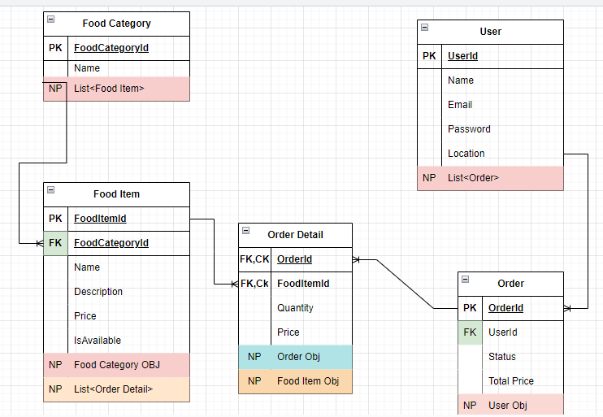

# Foodi
+ Is an E-Commerce Web Application designed to facilitate online food ordering from the Foodi restaurant. The application streamlines the process of ordering food for customers, providing them with a user-friendly platform to browse the restaurant's menu, place orders, make payments, and receive their desired dishes conveniently.

## Pages

### Dashboard Home Page

- Display The Restaurant details

### Food Category Page

- Display The categories in the restaurant.
- List products assigned to the category.
- Provide links to view Items of each category.

## Database Setup

- DbContext class for interacting with the database.
- DbSet properties for both Category and Product entities.
- Seed data to populate the database with initial categories and products.

## ERD (Entity Relationship Diagram)

